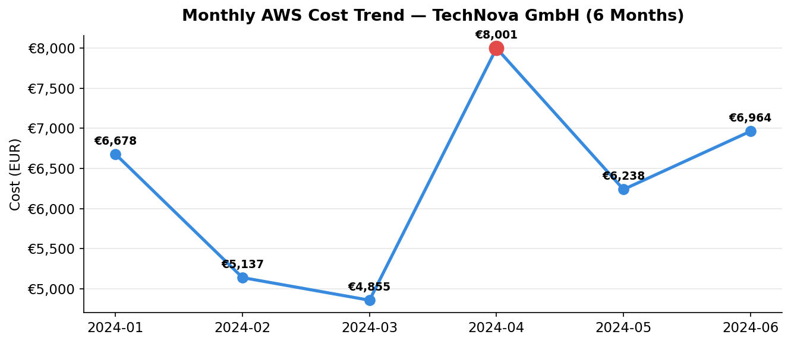
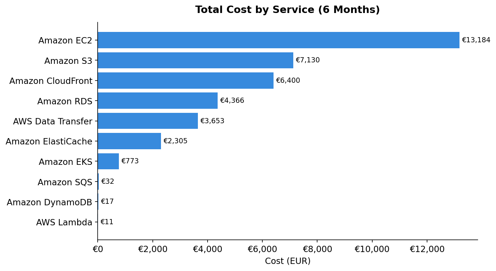
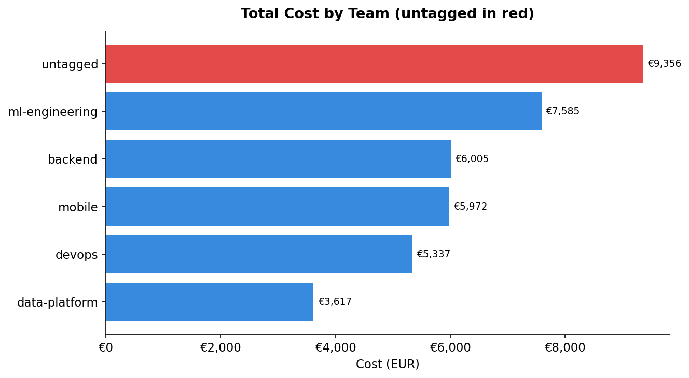
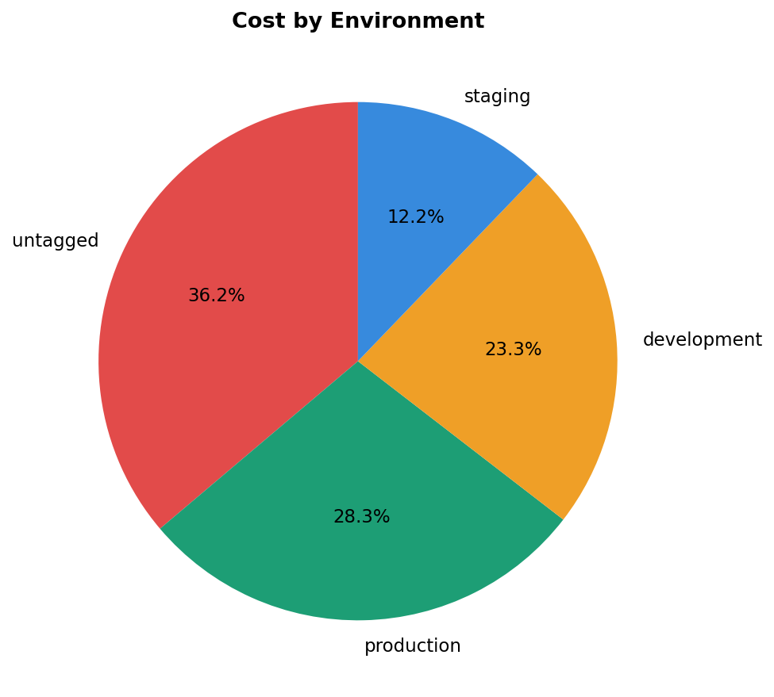
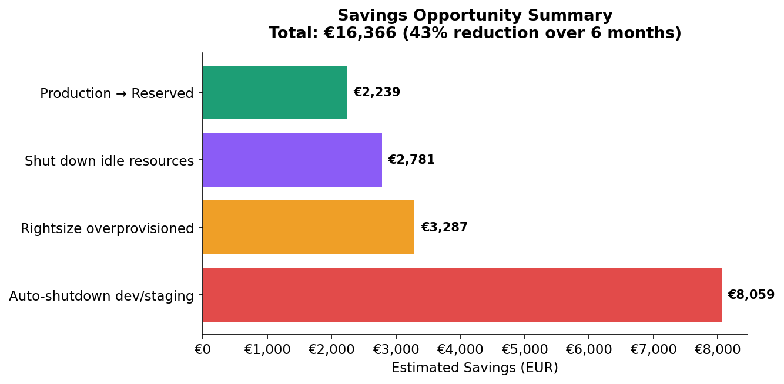

# ☁️ TechNova GmbH — AWS Cloud Cost Optimization Analysis


> **A FinOps data analysis project** simulating a Cortex Reply consulting engagement — analyzing 6 months of AWS cost data across 5 teams, 4 regions, and 10 services to identify **€16,366 in savings (43% reduction)**.

---

## 📋 Project Overview

| | |
|---|---|
| **Client** | TechNova GmbH (simulated) |
| **Analyst** | Cortex Reply FinOps Team |
| **Period** | January – June 2024 (6 months) |
| **Scope** | 5 teams · 4 AWS regions · 10 services |
| **Tools** | Python, Pandas, Matplotlib, Streamlit |

### The Problem

TechNova is a fast-growing SaaS company running entirely on AWS. Cloud spend has been climbing and volatile over 6 months. Leadership wants a full optimization review before planning next year's budget. They use a mix of pricing models (On-Demand, Reserved, Spot) but aren't sure they're using them correctly.

### Key Questions
1. Where is the money going — by team, region, service, and environment?
2. Are the right pricing models used for each workload?
3. Which resources are idle or overprovisioned?
4. Are resources running in expensive regions unnecessarily?
5. What are the biggest savings opportunities?

---

## 📊 Key Findings

### Monthly Cost Trend — volatile, spiking in April


Spend fluctuated month to month, peaking at **€8,001 in April** (a 65% jump from March). Total 6-month spend: **€37,872**.

---

### Cost by Service — EC2, S3, CloudFront dominate


The top 3 services (EC2, S3, CloudFront) account for **70% of all spend**. Tiny services like Lambda and DynamoDB are negligible.

---

### Cost by Team — untagged is the biggest "team"


**25% of spend (€9,355) is untagged** — more than any real team. This blocks proper cost allocation and chargeback.

---

### Cost by Environment — 35% is non-production


Development + staging = **35.5% of spend**, higher than production itself. These environments run 24/7 but are only used during business hours — the single biggest savings opportunity.

---

### Savings Opportunities — €16,366 identified


---

## 💡 Savings Summary

| # | Finding | 6-Month Saving | Effort | Priority |
|---|---------|----------------|--------|----------|
| 1 | Auto-shutdown dev/staging environments | €8,059 | Low | High |
| 2 | Rightsize overprovisioned resources | €3,287 | Medium | High |
| 3 | Shut down idle resources (<10% CPU) | €2,781 | Low | High |
| 4 | Move production On-Demand → Reserved | €2,238 | Medium | Medium |
| | **Total** | **€16,366** | | **43% reduction** |

---

## 🔬 Analysis Highlights

This project goes beyond basic cost reporting:

- **Multi-dimensional analysis** — cost broken down by service, team, region, environment, and pricing model
- **Pricing efficiency** — checking whether On-Demand, Reserved, and Spot are used on the right workloads (production should be Reserved, batch jobs should be Spot)
- **Smart rightsizing** — identifies overprovisioned resources using BOTH CPU and memory metrics, and explicitly protects **memory-bound** resources (low CPU but high RAM) that would crash if downsized
- **Feature engineering** — engineered flags like `is_idle`, `safe_to_downsize`, `memory_bound`, and `region_tier` to power the analysis

---

## 🗂️ Project Structure

```
finops-technova-v2/
│
├── v2_aws_billing.csv            # AWS Cost & Usage data (300 rows)
├── v2_usage_metrics.csv          # CPU & memory utilization (300 rows)
├── v2_resource_inventory.csv     # Resource ownership metadata (300 rows)
│
├── TechNova_v2_Analysis.ipynb    # Full analysis notebook
├── v2_dashboard.py               # Streamlit dashboard (6 tabs)
├── README.md
│
└── v2_charts/
    ├── 01_monthly_trend.png
    ├── 02_by_service.png
    ├── 03_by_team.png
    ├── 04_by_environment.png
    └── 05_savings.png
```

---

## 🚀 How to Run

### 1. Clone the repo
```bash
git clone https://github.com/ayhambokli/finops-technova-v2.git
cd finops-technova-v2
```

### 2. Install dependencies
```bash
pip install pandas numpy matplotlib streamlit
```

### 3. Run the notebook
```bash
jupyter notebook TechNova_v2_Analysis.ipynb
```

### 4. Launch the dashboard
```bash
streamlit run v2_dashboard.py
```

---

## 🔍 Workflow

| Step | Description |
|------|-------------|
| 1. Load | Read 3 AWS datasets |
| 2. Explore | Inspect structure, types, missing values, unique values |
| 3. Clean | Remove duplicates, fix dates, normalize environments, fill tags, USD→EUR |
| 4. Feature Engineering | Create flags: idle, safe-to-downsize, memory-bound, region-tier |
| 5. Merge | LEFT JOIN on resource_id + billing_period (avoids row explosion) |
| 6. Analyse | 9 analyses across services, teams, regions, environments, pricing |
| 7. Report | Findings, conclusions, prioritized recommendations |
| 8. Dashboard | Interactive Streamlit app with 6 tabs |

---

## 💡 FinOps Concepts Applied

- **FinOps Lifecycle** — Inform → Optimize → Operate
- **Cost allocation & tagging** — identifying untagged spend
- **Pricing optimization** — On-Demand vs Reserved vs Spot per workload type
- **Rightsizing** — using CPU + memory metrics, protecting memory-bound resources
- **Environment governance** — auto-shutdown for non-production
- **Regional cost analysis** — identifying spend in expensive regions

---

*Built as part of interview preparation for a FinOps Data Analyst & Consultant role at Cortex Reply.*
